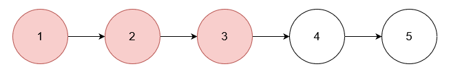

# 3217. Delete Nodes From Linked List Present in Array

You are given an array of integers `nums` and the `head` of a linked list. Return the `head` of the modified linked list after removing all nodes from the linked list that have a value that exists in `nums`.

 
### Example 1

Input `nums = [1,2,3], head = [1,2,3,4,5]`

Output `[4,5]`

> Explanation:

> Remove the nodes with values 1, 2, and 3.

### Example 2

Input `nums = [1], head = [1,2,1,2,1,2]`

Output `[2,2,2]`

> Explanation:  

> Remove the nodes with value 1.

### Example 3

Input `nums = [5], head = [1,2,3,4]`

Output `[1,2,3,4]`

> Explanation:  

> No node has value 5.

 
### Constraints

`1 <= nums.length <= 10^5`

`1 <= nums[i] <= 10^5`

`All elements in nums are unique.`

`The number of nodes in the given list is in the range [1, 10^5].`

`1 <= Node.val <= 10^5`

`The input is generated such that there is at least one node in the linked list that has a value not present in nums.`

### Topics
- Array
- Hash Table
- Linked List
- Weekly Contest 406

---

### Hint 1
Add all elements of nums into a **Set**.

### Hint 2
Scan the list to check if the current element should be deleted by checking the **Set**.